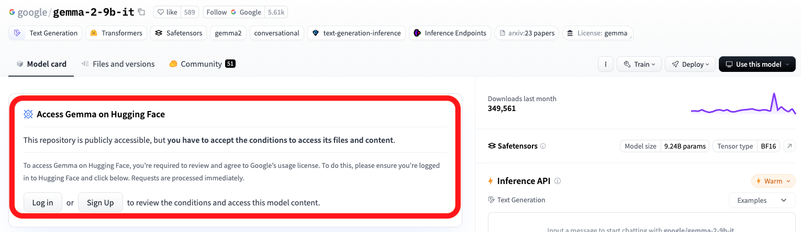
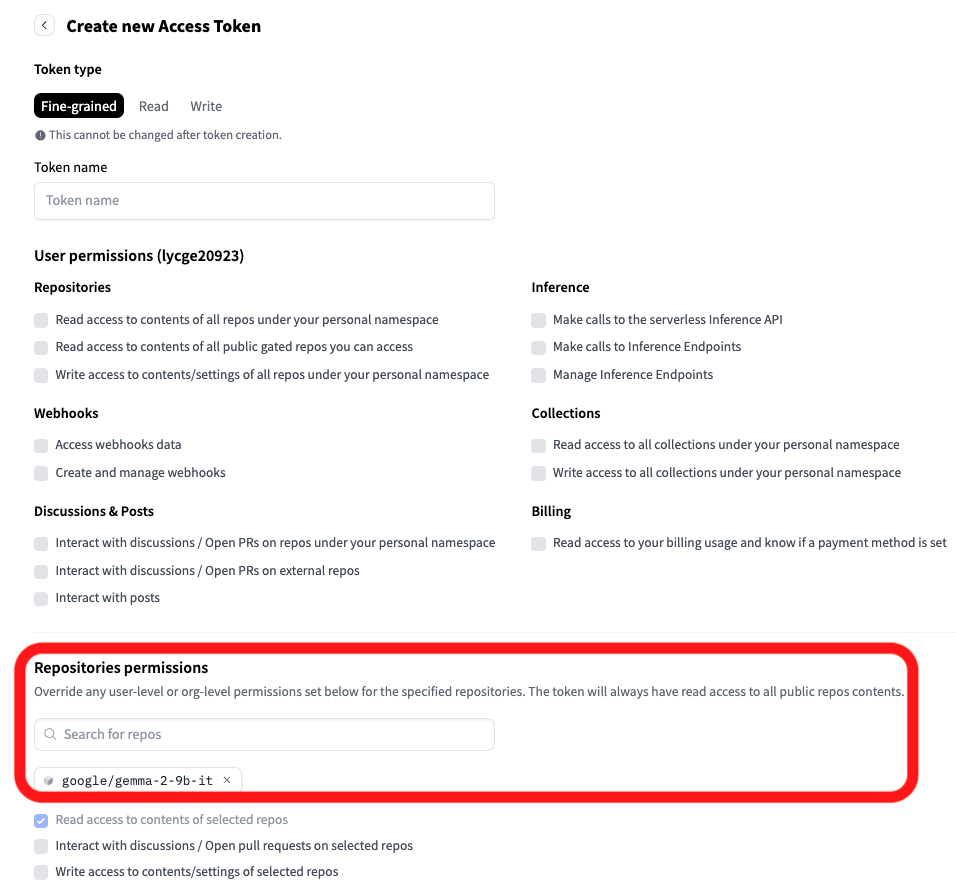
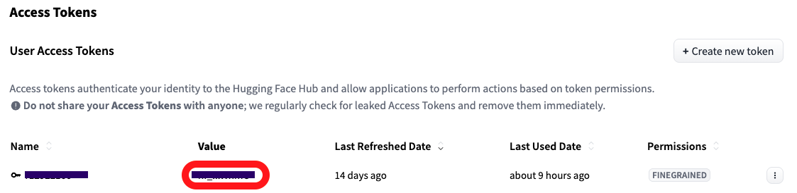

# Environment

* **System**: Ubuntu 22.04.4 LTS (GNU/Linux 5.15.0-125-generic x86_64)
* **GPU**: NVIDIA RTX A6000

# Initialization

## Create the Execution Environment

* Execute the following commands:

   ```
   conda create --name <Your env name> python=3.10.12 -y
   conda activate <Your env name>
   ```

* Download the required packages:

   ```
   pip install -r requirements.txt
   ```

## Get the Permission to Use the Model

* Since we use the model ```google/gemma-2-9b-it```, which requires logging in to Hugging Face, you need to do the following:

1. Obtain access to the ```google/gemma-2-9b-it``` model by visiting the [link](https://huggingface.co/google/gemma-2-9b-it) to request permission.

   

2. Create an **Access Token** to enable the use of ```google/gemma-2-9b-it```.

   

   

3. After creation, copy the access token value.

   

4. Return to this repository and create a ```.env``` file in the root directory with the following format:

   ```
   HUGGINGFACE_HUB_TOKEN=<your access token>
   ```

## Download the Data

* Run the following command to download the dataset:
   ```
   python setup_data.py
   ```

## Check Your Environment

* After setting up the datasets and installing the required packages, it's crucial to verify your environment:

   ```
   python test_env.py
   ```

   * You should see each task marked as PASSED when evaluated on ground truth data. For example:

      ```
      Task: sql_generation_public
      Metric: EX
      Score: 0.9993 (score > 0.99)
      Result: PASSED
      ------------------------------
      ```

# Execution 

* **Make sure that you have completed the steps of initialization!**

* Conduct the following code

   ```
   python3 main.py --bench_name classification_public --output_path <results_path> #for classification
   python3 main.py --bench_name sql_generation_public --output_path <results_path> #for text-to-sql
   ```

   * Ensure that ```<results_path>``` includes at least one directory level. For example:

      * ✅: ```./output.csv```, ```dir/output.csv```

      * ❌: ```output.csv```